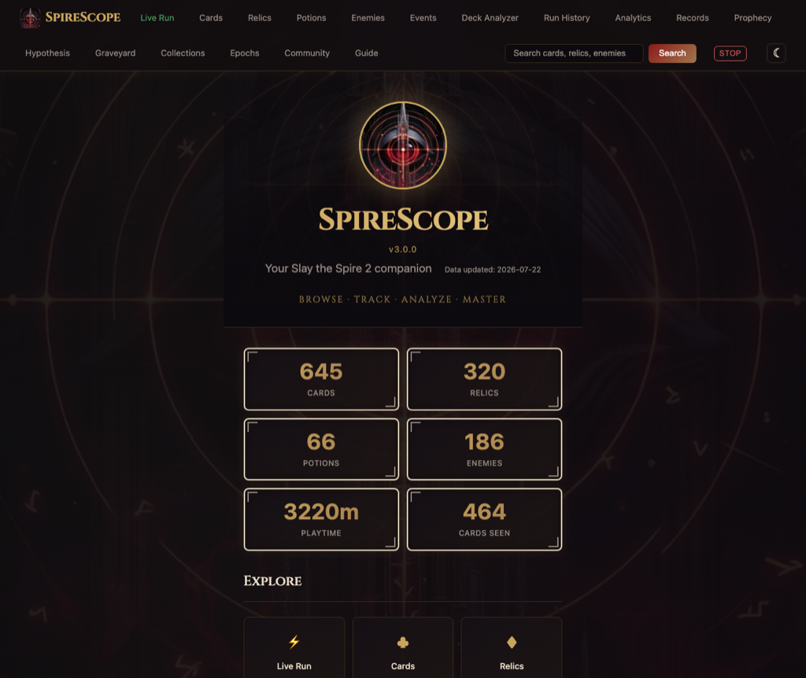
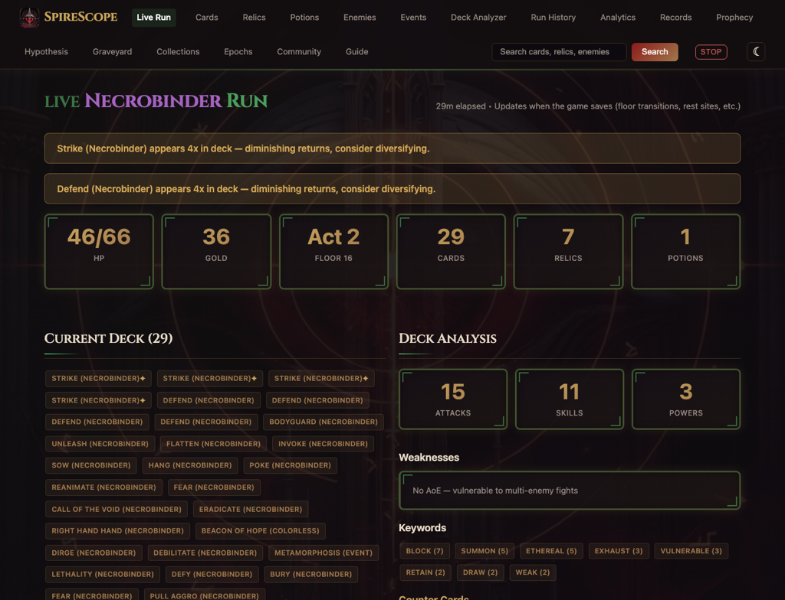
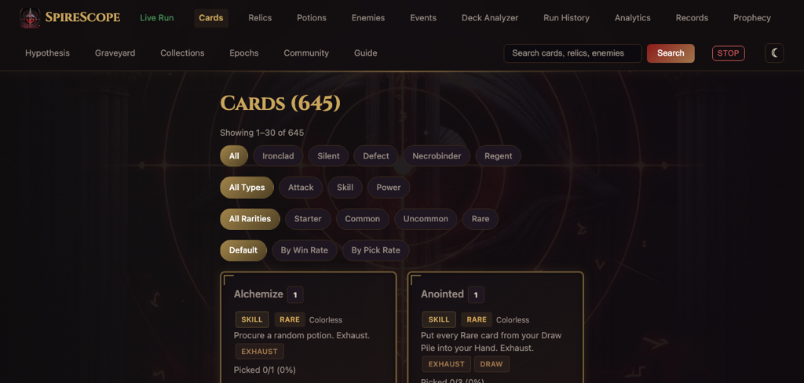

<h1 align="center">⚔ S P I R E S C O P E ⚔</h1>
<p align="center"><em>Card lookup · Deck analysis · Live run tracking · Analytics for Slay the Spire 2</em></p>

<p align="center">
  
  
  
  
  
</p>

A local-first intelligence dashboard for **Slay the Spire 2** — card/relic/enemy lookup, deck analysis, live run tracking, run history, analytics, community meta, and strategy guides. No cloud, no accounts, no telemetry. Runs entirely on your machine.

<p align="center">
  
</p>

<p align="center">
  
</p>

<p align="center">
  
</p>

## Features

### Browse & Research

- **Card Browser** — All cards across 5 characters with filters by character, type, rarity, cost, and keyword. Paginated (30 per page).
- **Relic & Potion Browser** — Browse and filter all relics and potions
- **Enemy Guides** — Boss patterns, elite strategies, and encounter tips
- **Event Guide** — Optimal choices for every event
- **Strategy Guides** — Per-character archetypes, key cards, key relics, and general tips

### Play & Track

- **Live Run Tracker** — Real-time dashboard via Server-Sent Events (SSE) — no page reloads. Shows deck, relics, potions, HP, floor history, counter-cards, synergy hints, danger alerts, encounters won, and events encountered.
- **Deck Analyzer** — Select cards to get archetype detection, synergy analysis, weakness identification, and suggestions. Save/load decks to localStorage.
- **Run History** — Floor-by-floor breakdown with HP tracking, card picks, cards offered (what you rejected), potions gained, monsters fought, gold per floor, and damage taken. Visual HP timeline chart. Import/export runs as JSON or standalone HTML.
- **Run Comparison** — Side-by-side comparison of two runs with deck diff, relic diff, and stat comparison
- **Collections** — Track card/relic discovery progress with ascension filtering
- **Epochs** — Track all 49 epoch unlock requirements, see what's locked/unlocked, filter by category and character
- **Co-op Support** — Track any player in a multiplayer run via `?player=N`

### Analyze & Compete

- **Analytics** — Aggregate stats: per-character win rates, floor survival, card pick rates, HP curves, death floor heatmaps, and causes of death. Filter by ascension level, game version, or time range. Boss matchup intelligence, per-character relic tiers, and card pick heatmaps.
- **Personal Records** — Hall of fame with fastest win, highest ascension, biggest/smallest deck, flawless bosses, per-character breakdowns, and notable achievements
- **Per-Act Breakdown** — Damage, card picks, deaths, and gold tracked separately for Act 1/2/3
- **Combat Efficiency** — Average turns per fight type with scaling trend analysis and turns-vs-damage correlation
- **Archetype Detection** — Auto-classify decks into archetypes (Strength Scaling, Poison, etc.) with per-archetype win rates
- **Card Pick Timing** — When you pick cards: early (floors 1-10), mid (11-25), or late (26+)
- **Encounter Danger Ratings** — Danger grades (Low/Medium/High/Extreme) for every encounter based on your damage history
- **Gold Economy** — Track gold earned, gold at death, peak gold, and win-vs-loss gold comparison
- **Co-op Analytics** — Compare multiplayer vs solo win rates (shown only when co-op runs exist)
- **Healing Sources** — Breakdown of HP recovery by source: rest sites, combat, and passive/relic healing
- **Boss Matchups** — Win rate, average damage, and fight count per boss, broken down by character
- **Relic Tiers by Character** — Top relics by win rate for each character
- **Card Pick Heatmap** — Pick rate vs win rate grid — green means pick and win, red means pick and lose
- **Card Regret Analysis** — Cards you pick in losses but skip in wins, helping identify bad picks
- **Win Streak Tracker** — Prominent current win streak display on the home page
- **Next Epoch Suggestions** — Upcoming epochs you haven't unlocked yet with requirements and rewards
- **Community Meta** — Tier lists and strategy posts from Reddit and Steam, community-voted card tiers, aggregate player stats with import/export
- **Global Search** — Fuzzy search with "Did you mean?" suggestions across all entities

### Advanced Analytics (v2.9.0)

- **The Graveyard** — Every dead run gets a procedural epitaph: *"Had 4 potions. Used none of them."* Visit `/graveyard` to see your memorial wall.
- **Ghost Run Comparison** — Speedrun-style splits against your best run. See HP and gold deltas floor by floor during live runs. Green arrows = ahead, red = behind.
- **Tilt Detection** — Tracks session momentum and warns when you're on a losing streak: *"Your last 4 runs averaged floor 11. Your session average is 23. Consider a break."*
- **Anti-Pattern Detection** — Named recurring mistakes: "The Hoarder" (unused potions), "The Greedy Builder" (oversized decks), "The Coward" (skipping elites).
- **Deck Health Score** — Synergy graph analysis scoring deck coherence from 0-100. Identifies orphan cards with zero synergy connections.
- **Archetype Drift** — Alerts when your card picks drift away from your deck's archetype mid-run.
- **Strategy Memory** — Tracks which strategies you use over time. Frequently-used strategies glow bright; forgotten ones fade.
- **Cascade Map** — Click any card in a completed run to see its downstream impact: how damage, fight length, and HP changed after picking it.
- **Prophecy Engine** — Pre-run predictions based on your history: win probability, danger zone floors, and strategic recommendations.
- **Autopsy Report** — When you die, 5 diagnostic agents analyze what went wrong AND what went right. Causal chain narrative + exculpatory findings.
- **Hypothesis Lab** — Register strategic beliefs (*"Skipping elites helps"*) and test them with Bayesian statistics across your runs.
- **Rivalry Seeds** — Export your run, share the seed with a friend, import their run, and see a floor-by-floor decision diff.
- **Run Integrity** — SHA-256 Merkle chain proves a run is unmodified. Share your hash to verify achievements.

### Customize & Extend

- **Keyboard Shortcuts** — Press `?` for shortcut help, navigate pages with single keys, `/` to search
- **Dark/Light Theme** — Dark gothic fantasy aesthetic (Cinzel serif font, warm gold/crimson palette) with a warm parchment light mode toggle
- **Mod Support** — Load custom cards, relics, and enemies from JSON files in a mods directory
- **Content Creator API** — Paginated JSON endpoints with CSV export and optional API key bypass
- **User Guide** — In-app guide covering setup, features, and troubleshooting

## Quick Start

### Download (No Python Required)

**[Download Spirescope for Windows](https://github.com/thequantumfalcon/spirescope/releases/latest/download/Spirescope-windows.zip)** — extract the zip, open the `Spirescope` folder, double-click `Spirescope.exe`, leave the console window open, then open `http://127.0.0.1:8000` in your browser. Release archives also ship with `.sha256` checksum files.

Windows may still show a SmartScreen or reputation warning because the build is unsigned. SpireScope is open source, local-only by default, and the packaged release avoids the usual UPX-compressed hidden-window profile that tends to trigger extra false positives.

If you're cautious about unsigned Windows apps, that's fair. Grab SpireScope from this repo's Releases page, check the `.sha256` file, and look through the source, tests, and changelog here before you run it.

### From Source

```bash
pip install -e .
spirescope
```

Or run directly:

```bash
python -m sts2
```

Opens your browser at [http://127.0.0.1:8000](http://127.0.0.1:8000).

### Build Executable

```bash
pip install -e ".[dev]"
python build.py
```

Output: `dist/Spirescope/Spirescope.exe` — zip the entire `dist/Spirescope/` folder and share it.
Local builds also write `dist/SHA256SUMS.txt` for checksum verification.

### Docker

```bash
docker build -t spirescope .
docker run -p 8000:8000 spirescope
```

## Why SpireScope?

Unlike cloud trackers, SpireScope runs entirely on your machine -- your run data never leaves your PC. Unlike browser extensions, it works on any OS and doesn't require game mods. Unlike the wiki, it knows your specific run history and tracks how your win rate changes across patches, characters, and ascension levels. And unlike anything else in the STS2 ecosystem, it's fully open source.

## Works Without STS2 Installed

The card browser, relic browser, enemy guides, event guides, deck analyzer, and strategy guides all work without any save files. If you're curious about the game before buying, SpireScope is a full reference tool.

## Using with Mods

SpireScope automatically checks both vanilla and modded save paths and uses whichever contains more recent runs. If you use multiple mods, install [UnifiedSavePath](https://www.nexusmods.com/slaythespire2/mods/6) (NexusMods mod #6) to merge both paths into one location.

- Vanilla: `%APPDATA%\SlayTheSpire2\steam\<id>\profile1\saves\`
- Modded: `%APPDATA%\SlayTheSpire2\steam\<id>\modded\profile1\saves\`

## Streamer Mode / OBS Browser Source

SpireScope's live run tracker works as an OBS browser source. Two options:

- **Full view**: Add `http://127.0.0.1:8000/live` as a Browser Source — full dashboard with all coaching features
- **Overlay mode**: Add `http://127.0.0.1:8000/overlay` — minimal transparent HUD showing character, floor, HP bar, top cards, and danger alerts. Designed for always-on-top windows or small OBS overlays.

Both update in real time via SSE — no page reloads, no stream interruption. Use `?player=N` for co-op runs to track a specific teammate.

## Steam Deck

SpireScope runs on Steam Deck via the Linux source install. From Desktop Mode:

```bash
pip install -e .
spirescope
```

Save path (Proton): `~/.local/share/Steam/steamapps/compatdata/2832040/pfx/drive_c/users/steamuser/AppData/Local/SlayTheSpire2/`

Set `STS2_SAVE_DIR` to this path if auto-detection doesn't find your saves.

## CLI Commands

```bash
spirescope              # Start the web dashboard (default)
spirescope serve        # Same as above
spirescope serve --browser     # Force opening browser automatically
spirescope serve --no-browser  # Start without opening browser
spirescope update       # Fetch latest data from the wiki + saves
spirescope update --save-only  # Discover from saves only (no network)
spirescope community    # Fetch community data from Reddit and Steam
spirescope export       # Export aggregate stats to JSON file
spirescope reset-stats  # Delete aggregate stats file
spirescope sync-up      # Upload local aggregate stats to sync service
spirescope sync-down    # Download and merge community stats from sync service
spirescope --help       # Show usage
spirescope --version    # Show version
```

## Configuration

| Variable | Description | Default |
|----------|-------------|---------|
| `STS2_SAVE_DIR` | Path to your STS2 save directory | Auto-detected |
| `STS2_GAME_DIR` | Path to STS2 game install | Auto-detected |
| `STS2_MODS_DIR` | Path to mods directory (JSON files) | `sts2/data/mods/` |
| `STS2_HOST` | Server bind address | `127.0.0.1` |
| `STS2_PORT` | Server port | `8000` |
| `STS2_COMMUNITY_SOURCES` | Community sources: `all`, `reddit`, `steam` | `all` |
| `STS2_SYNC_URL` | Sync service URL (opt-in) | Disabled |
| `STS2_SYNC_KEY` | API key for sync service | None |
| `SPIRESCOPE_API_KEY` | Optional API key for rate limit bypass | None |
| `SPIRESCOPE_ADMIN_TOKEN` | Token for `/api/reload` and `/api/reset/stats` | Auto-generated |
| `SPIRESCOPE_OPEN_BROWSER` | `1`/`0` override for browser auto-open on `serve` | Source: enabled, frozen build: disabled |
| `SPIRESCOPE_CHECK_UPDATES` | `1`/`0` override for automatic GitHub update checks | Source: enabled, frozen build: disabled |
| `STS2_CORS_ORIGINS` | Comma-separated CORS allowed origins | Localhost only |

### Save File Location

- **Windows**: `%APPDATA%\SlayTheSpire2\steam\<steam_id>\profile1\saves\`
- **Windows (modded)**: `%APPDATA%\SlayTheSpire2\steam\<steam_id>\modded\profile1\saves\`
- **macOS**: `~/Library/Application Support/SlayTheSpire2/steam/<steam_id>/profile1/saves/`
- **Linux**: `~/.local/share/SlayTheSpire2/steam/<steam_id>/profile1/saves/`

SpireScope auto-detects both vanilla and modded paths and uses whichever has more recent data.

## API Endpoints

| Endpoint | Method | Description |
|----------|--------|-------------|
| `/api/search?q=` | GET | Search all entities |
| `/api/cards/{card_id}` | GET | Card details + stats (JSON) |
| `/api/runs` | GET | Run history (JSON, filterable by character/result) |
| `/api/analytics` | GET | Aggregate analytics (JSON) |
| `/api/live?player=0` | GET | Current run state (JSON) |
| `/api/live/stream?player=0` | GET | SSE stream of live run updates |
| `/api/export/stats` | GET | Export aggregate player stats (JSON) |
| `/api/export/runs` | GET | Export run history (CSV) |
| `/api/import/stats` | POST | Import/merge aggregate stats |
| `/api/reload` | POST | Hot-reload knowledge base (requires `X-Admin-Token` header) |
| `/api/reset/stats` | POST | Reset aggregate stats (requires `X-Admin-Token` header) |
| `/overlay?player=0` | GET | Minimal overlay for OBS browser source or second monitor |
| `/shutdown` | POST | Gracefully stop SpireScope (localhost only) |
| `/health` | GET | Health check for monitors |
| `/docs` | GET | Interactive API documentation (Swagger UI) |

## Security

- CSRF protection on all POST forms
- Content-Security-Policy, X-Frame-Options, Referrer-Policy, X-Content-Type-Options
- Per-IP rate limiting (60 req/min) with automatic memory cleanup
- Admin-token-gated reload endpoint (constant-time comparison)
- SSE connection cap (10 concurrent) with 5-minute idle timeout
- Jinja2 auto-escaping on all user-reflected input
- Log injection prevention (control character sanitization)
- Request body size limits on deck analysis and stats import
- Input validation on all query parameters
- Anti-manipulation caps on aggregate stats merging

## Project Structure

```
sts2/
  __main__.py        # CLI entry point
  app.py             # FastAPI app, middleware, security headers
  routes.py          # All route handlers
  analytics.py       # Run analytics computation
  community/         # Multi-source community data (Reddit + Steam)
    __init__.py      # Orchestrator + re-exports
    _types.py        # Shared types, extraction functions
    _merge.py        # Weighted merge logic
    reddit.py        # Reddit data fetcher (public JSON API)
    steam.py         # Steam data fetcher (reviews, guides, discussions)
  aggregate.py       # Aggregate stats computation and merging
  config.py          # Auto-detected paths and settings
  fetcher.py         # Data fetcher (wiki + save file discovery)
  knowledge.py       # Search, filter, synergy, and deck analysis engine
  logparser.py       # Game log tailer for live run tracking
  models.py          # Pydantic models for all game entities
  saves.py           # Save file parser (progress + run history + co-op)
  sync.py            # Aggregate sync client (upload/download)
  updater.py         # Auto-update checker
  watcher.py         # File watcher with debounce + polling fallback
  data/              # JSON game data + mods
  templates/         # Jinja2 HTML templates (22 templates)
  static/            # CSS, fonts (Cinzel), images, JS
tests/               # 613+ tests (pytest + pytest-asyncio)
```

## Requirements

- Python 3.11+
- Slay the Spire 2 (for save file features)

## Disclaimer

SpireScope is a fan-made project and is not affiliated with, endorsed by, or associated with [Mega Crit Games](https://www.megacrit.com/). Slay the Spire and Slay the Spire 2 are trademarks of Mega Crit Games. All game content and materials referenced within this tool are the property of their respective owners.

## License

MIT
